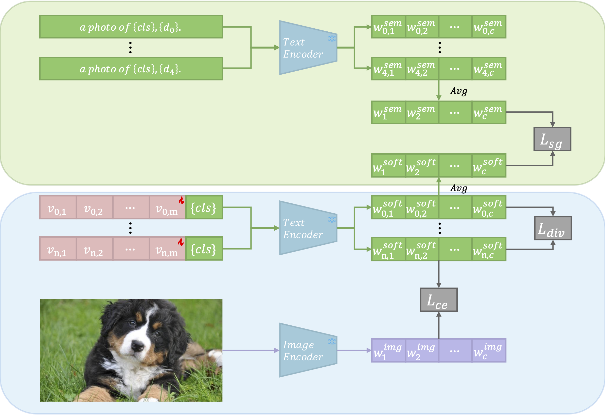

# MSGCoOp: Visual-Language Prompt Tuning with Knowledge-guided Context Optimization

[](https://github.com/Rain-Bus/MSGCoOp)
[](https://github.com/Rain-Bus/MSGCoOp)

## Overview of MSGCoOp

We introduce **Multi-prompt Semantic-Guided Context Optimization (MSGCoOp)**, a novel framework that advances CLIP-based prompt tuning for few-shot learning. MSGCoOp addresses the challenge of generalizing to novel classes efficiently, without heavy architectural modifications or expensive computation.

MSGCoOp employs an ensemble of $N$ parallel learnable context vectors (where $N \geq 1$) to create multiple, diverse prompt features. This multi-prompt design increases the expressive capacity of text representations without introducing additional trainable network layers or complex inter-prompt couplings—keeping the method lightweight and efficient.

To further enrich the prompts semantically, MSGCoOp automatically integrates class descriptions generated by large language models (LLMs). This automation reduces manual engineering effort and infuses rich, external knowledge into the prompt space. To ensure each context vector learns complementary and non-redundant features, we introduce a diversity regularization loss that encourages orthogonality among prompts.

A schematic overview of the MSGCoOp architecture can be found below:



## Main Contributions

- **Textual Multi-Prompt Learning**: Parallel context vectors with ensemble fusion provide diverse prompt representations.
- **Automatic Semantic Enrichment**: LLM-generated class descriptions empower contextual prompts for improved generalization.
- **Diversity Regularization**: Promotes complementary and orthogonal prompts to prevent redundancy in learned features.
- **Extensive Empirical Validation**: Thorough experiments across standard and cross-domain tasks demonstrate the effectiveness and efficiency.

## Results

MSGCoOp demonstrates strong improvements in both base-to-novel and cross-domain generalization tasks. On 11 benchmark datasets, MSGCoOp achieves:
- **+1.10% harmonic mean accuracy** over the previous strong baseline KgCoOp in base-to-novel generalization.
- **Improved cross-domain generalization** with a +0.30% gain against KgCoOp and +0.14% over multi-modal MaPLe.
- **Ablation studies** show: semantic-guided prompting (LLM-described classes) brings a +0.82% accuracy boost, and the multi-prompt design provides an additional +0.58% increase over single-prompt setups.

These results highlight that MSGCoOp's integration of multi-prompt learning and LLM-based semantic enrichment not only simplifies prompt construction but also enhances model robustness and transferability.

## Getting Started

1. [Dassl.ProGrad.pytorch](Dassl.ProGrad.pytorch/) is the modified toolbox of [Dassl.pytorch](https://github.com/KaiyangZhou/Dassl.pytorch).
2. [MSGCoOp](MSGCoOp/). To get the results in our paper, follow the [README.md](MSGCoOp/README.md) under [MSGCoOp/](MSGCoOp/) to set the environment.

## Citation

If you use our work, please cite:
```bibtex
@inproceedings{msgcoop24,
    title={Visual-Language Prompt Tuning with Knowledge-guided Context Optimization},
    author={Zhaolong Wang},
    booktitle={arxiv},
    year={2024}
}
```


## Acknowledgements
Our code is based on [Co-CoOp and CoOp](https://github.com/KaiyangZhou/CoOp), [ProGrad](https://github.com/BeierZhu/Prompt-align), [KgCoOp](https://github.com/htyao89/KgCoOp) repository. We thank the authors for releasing their code. If you use our model and code, please consider citing these works as well.

